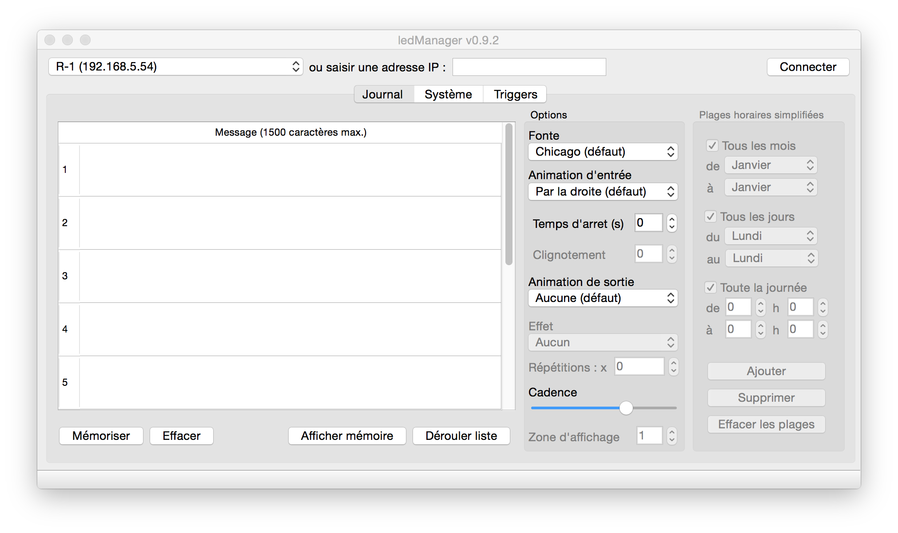

ledManager
==========

Open source software to manage EPL330 led display journal

Written in C++ under QtCreator 3.3.0 using Qt 5.4 on MacOSX 10.9.2

This software is open source and is free to modify and redistribute.

Please enclose source code when redistributing.

Feel free to contribute and share.

License
-------

ledManager - Graphical user interface to manage EPL330 led display journal

Martial GALLORINI (http://www.martialgallorini.com/)

This program is free software: you can redistribute it and/or modify
it under the terms of the GNU General Public License as published by
the Free Software Foundation, either version 3 of the License, or
(at your option) any later version.

This program is distributed in the hope that it will be useful,
but WITHOUT ANY WARRANTY; without even the implied warranty of
MERCHANTABILITY or FITNESS FOR A PARTICULAR PURPOSE. See the
GNU General Public License for more details.

You should have received a copy of the GNU General Public License 
along with this program.  If not, see <http://www.gnu.org/licenses/>.
